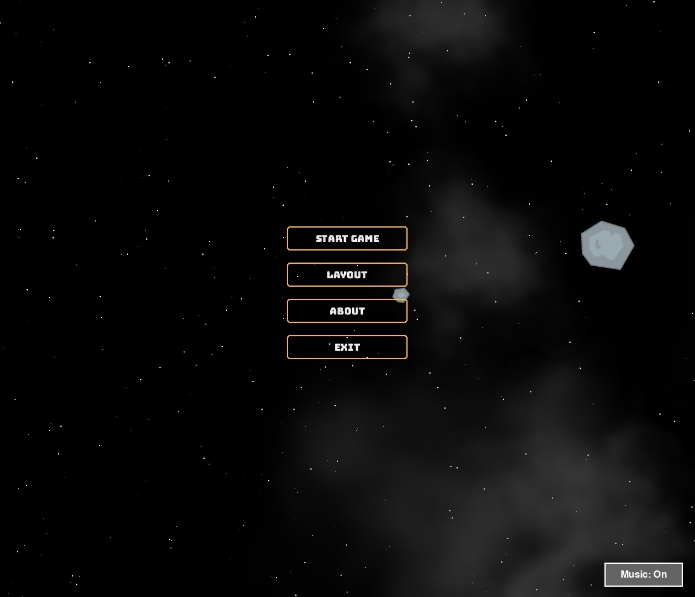
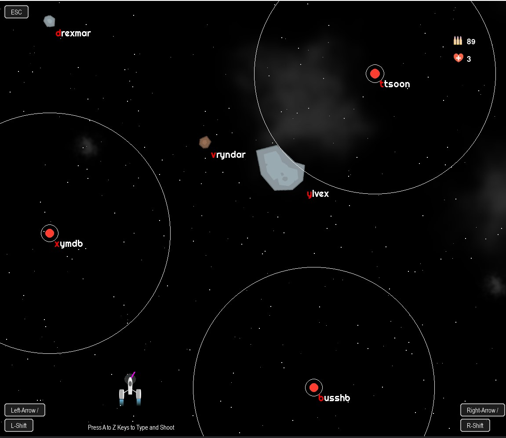
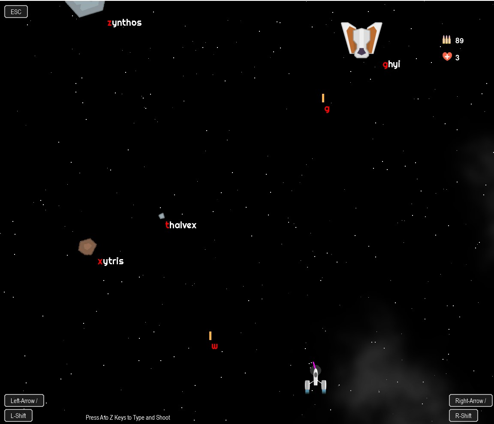

# 🚀 Typing Shooter: Space Adventure

🔤 **A Fast-Paced Typing Shooter Game – Set in Space**  

Space Adventure is an **action-packed space combat game** where you must **type to shoot bullets, destroy meteors, and battle a persistent enemy who taunts you throughout the campaign**. Test your typing speed and accuracy while fighting through thrilling space battles!

<div align="center">  
      
      
      
</div>  

---  

## 🎮 Features  
✔ **Type to Shoot** – Fire bullets by typing words quickly and accurately.  
✔ **Destroy Meteors** – Stop incoming meteors before they destroy your ship.  
✔ **Engaging Storyline** – Battle a recurring enemy who taunts you throughout the campaign.  
✔ **Dynamic Difficulty** – The game adapts to your typing speed and accuracy.  
✔ **Retro Sci-Fi Visuals** – A classic space shooter aesthetic with modern effects.  

---  

## 📥 Download & Install  

🔹 **Download the Game**  
Get the latest version from the **GitHub Releases page**:  
📎 **[Download Typing Shooter v1.0.0](https://github.com/YourUsername/YourRepo/releases/latest/download/TypingShooter.zip)**  

🔹 **How to Install (Windows & macOS)**  
1. **Download the game ZIP** from the link above.  
2. Extract the ZIP file to your desired location.  
3. Open the extracted folder and run `TypingShooter.exe` (Windows) or `TypingShooter.app` (macOS).  
4. Enjoy the game and improve your typing skills while saving the galaxy! 🚀  

---  

## 🛠️ Build & Run  
To compile and run this game, make sure you have:  
✅ **Python 3.x** – Required for running the game  
✅ **Pygame Installed** – Run `pip install pygame` to install dependencies  

### **Run the Project:**  
```sh  
git clone https://github.com/YourUsername/TypingShooter.git  
cd TypingShooter  
python main.py  
```  

---  

## 🎯 Future Updates  
📌 More enemy types and intense boss battles  
📌 Multiplayer mode for competitive typing battles  
📌 Power-ups and weapon upgrades  

---  

## 📬 Feedback & Support  
Found a bug or have suggestions? Open an issue or reach out via [your contact/email].
