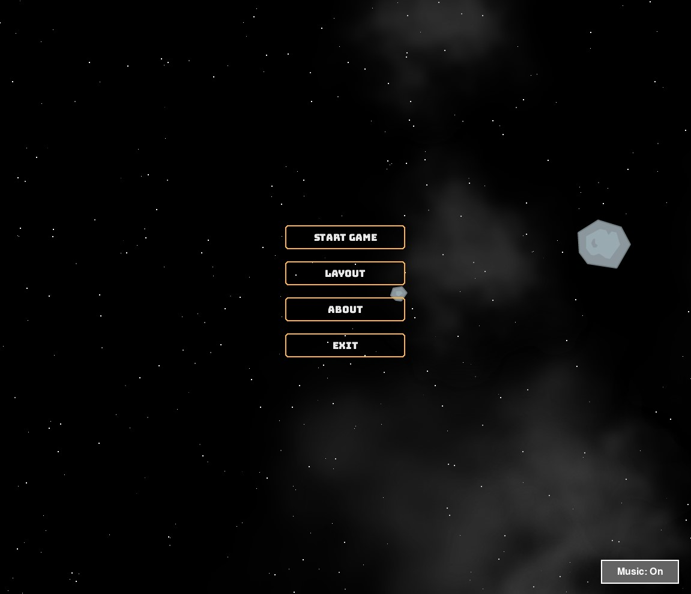
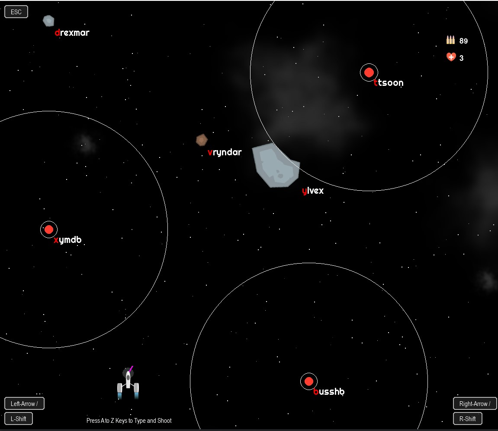
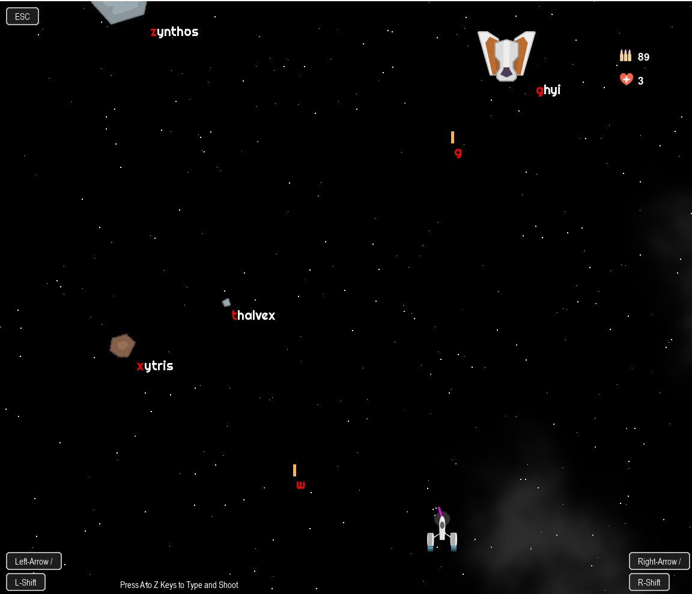
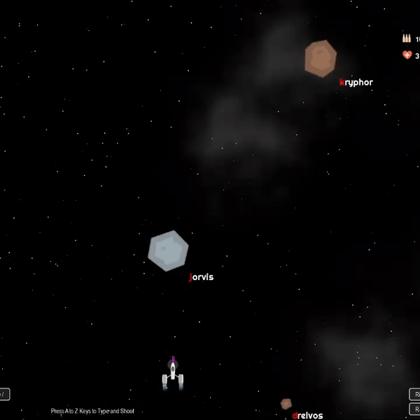
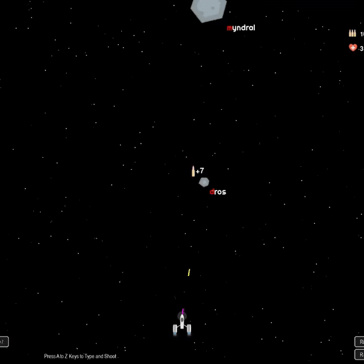
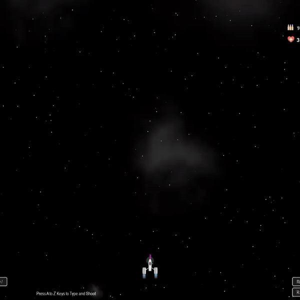
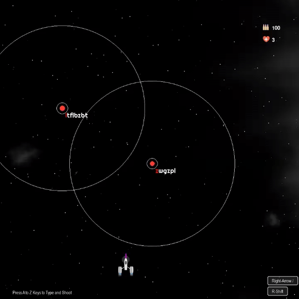
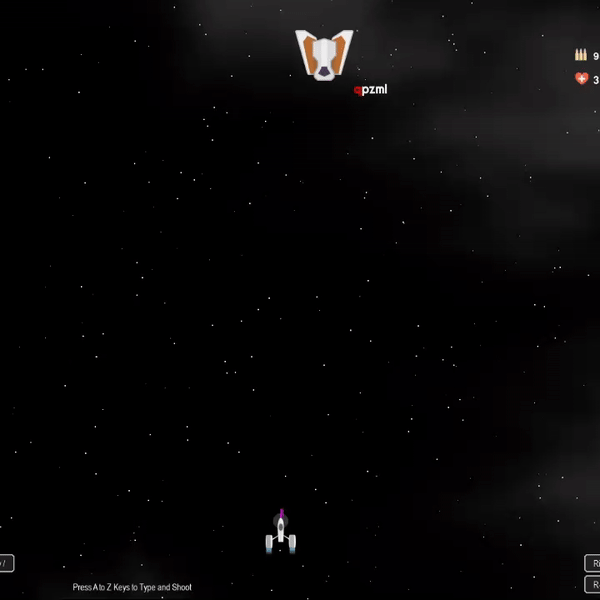
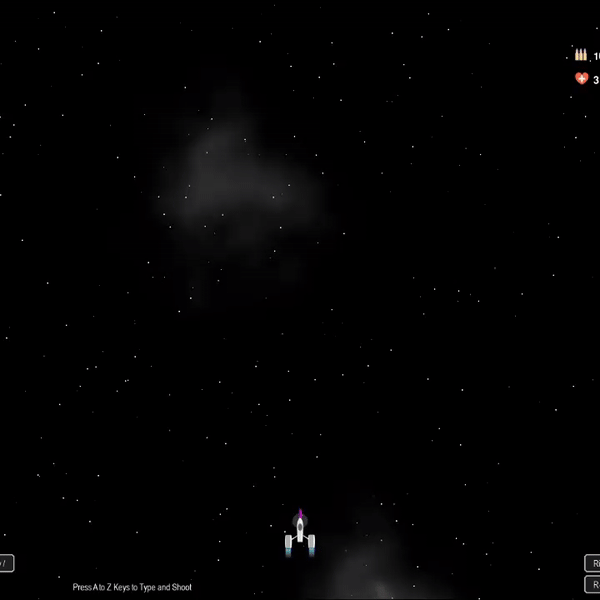

# Hey there! 👋

Thanks for checking out this little passion project.

**Most people probably never even try this game - and that's totally fine.**  
If you're here reading this... you've already gone further than 99% of folks. Thank you ❤️

### Quick backstory

This game started life in an **itch.io game jam**... but I missed the deadline.  
I got way too ambitious and tried to pack in far too many ideas... **classic rookie move.**

Life's got busy since then and my backlog is screaming at me, so this is the **"finished... ish"** version for now 😅

### What I learned

This project pushed my brain 🧠 to its absolute limits and taught me a ton.

It gave me real hands-on experience with the full game dev cycle, and I came away with massive respect for game developers - especially solo ones.

**About Pygame**: it's powerful and flexible, but definitely not for the faint of heart.  
You can build almost anything with it... yet for anything bigger than a small project, I'd reach for something like **Godot** or **Unity** next time.

---

If you actually played it (or just made it this far), feel free to drop a hello on any of my social links below.  
Feedback, wild ideas, or even rants about that one frustrating mechanic are all welcome 😅

Thanks again - you're awesome.

# 🚀 Typing Shooter: Space Adventure

 
 
 

**A fast-paced typing shooter built with Pygame.**  
Type words to fire bullets, destroy incoming enemies, and survive endless waves in deep space.  
Perfect for improving your **typing speed, accuracy, and reflexes** - or just blowing things up.

Defend your spaceship against relentless meteors, kamikaze drones, proximity mines, gunships, and massive battleships. Words appear above each enemy - type them quickly and correctly to shoot. The faster and more accurate you are, the longer you survive.

    
    
    

---

## 👾 Enemy Types

### ☄️ Meteors

Brainless chunks of floating rock - about the size of a city bus - hurtling through space.  
I swear I didn’t program them to chase you... but they *always* drift straight toward your ship.

---

### 💣 Suicide Drones
Small, insanely fast kamikaze attackers.  
They exist for one purpose: **ramming into you at full speed**.  
Keep typing - hesitation means death.

---

### 🧲 Proximity Bombs
Floating magnetic mines that activate when you get too close.  
They lock on, rush toward you, and explode on contact -  
like that suspicious ex who gets clingy the moment you pull away.

---

### 🔫 Enemy Gunships
Persistent fighters with near-infinite ammo.  
They’ll harass you nonstop - take them down fast or get worn down.

---

### 🚢 Enemy Battleships
Massive capital ships that demand **perfect typing** to destroy.  
They spawn drones, fire relentlessly, and soak up damage.  
Bring your A-game.

## 📥 Download & Install

### 🔹 Get the Game
Download the latest build from **GitHub Releases**:  
👉 **https://github.com/AshwaniDev101/PyGame-TypingShooter/releases/latest**

Available for **Windows** only.

### 🔹 Install
1. Download the ZIP from the latest release  
2. Extract it anywhere  
3. Run `TypingShooter.exe`  
4. That's it - enjoy!

---

## 📜 License & Usage

Feel free to **download, play, and modify** this game for your own personal use or learning — go wild, tweak it, break it, make it better!